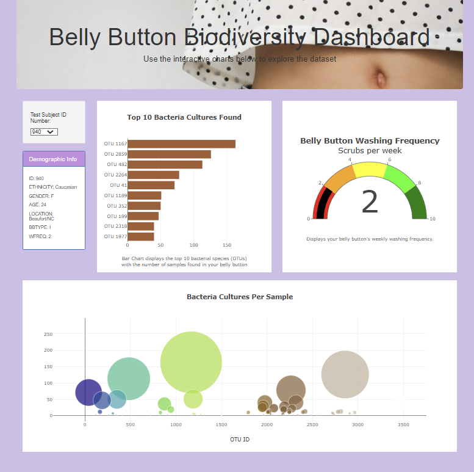
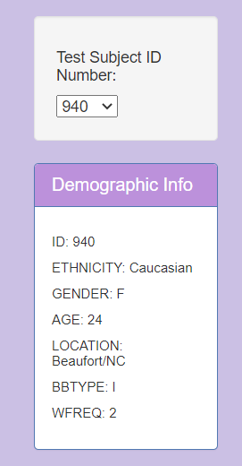
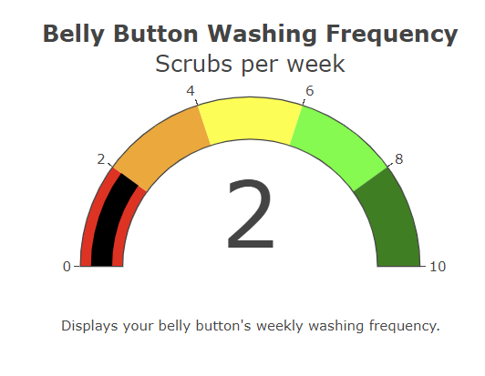
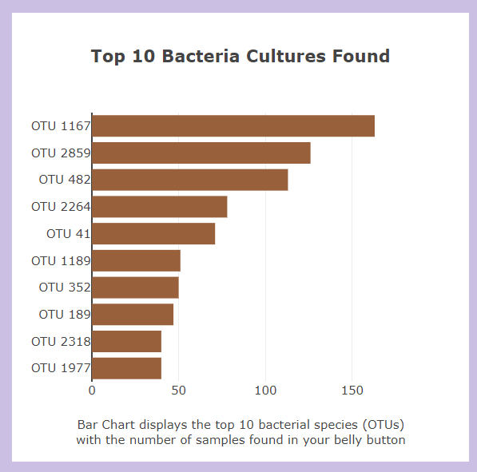
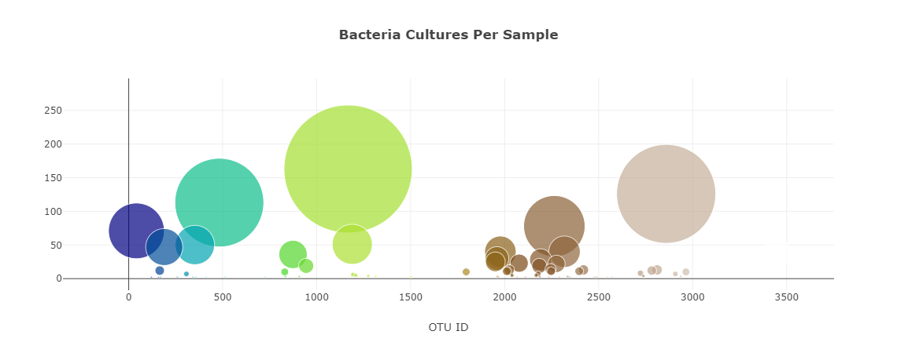

# Belly Button Biodiversity Dashboard
## Overview
In this project we used Plotly and Javascript to creat an interactive data visulaization for the web. 

## Summary
A test subject search drop-down menu was created to allow each individual to select their unique ID Number. Once the ID was selected they would have the demographic information and their graphed results automatically populated. 

Charts that were Created:

